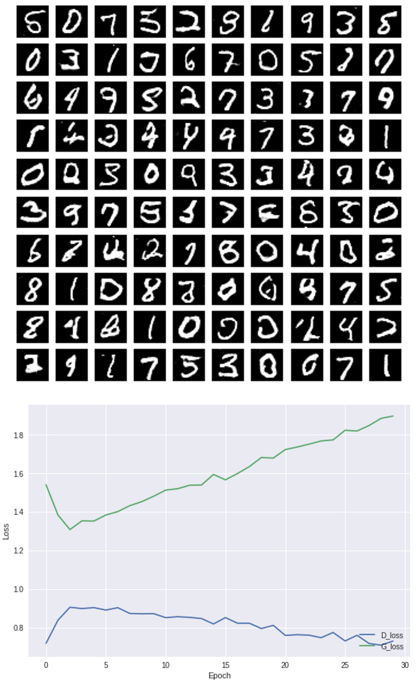
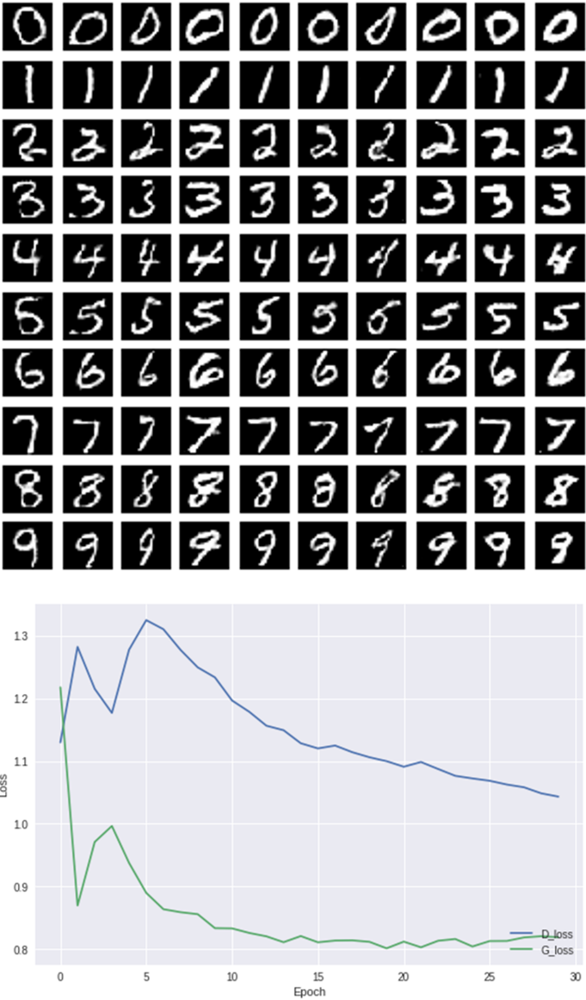
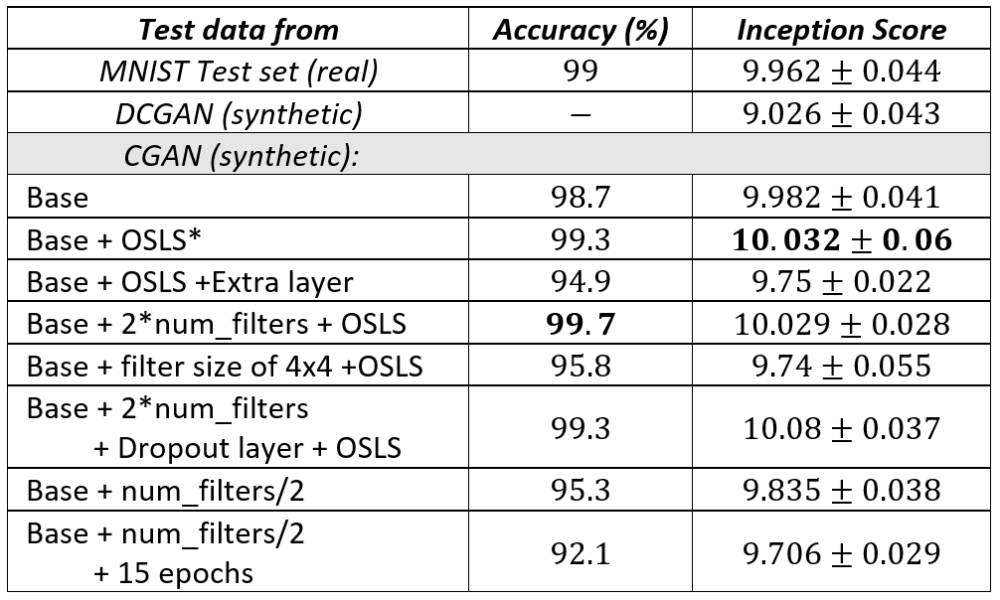

# DCGAN and cGAN implementations on MNIST dataset using Tensorflow

This repository includes DCGAN and cGAN models trained on MNIST data using Tensorflow. The models were given as Jupyter Notebook and python script formats.

## Description

### DCGAN

The DCGAN model generates images that look like handwritten digits with no regards to what digit it actually is. This makes it hard for a quantitative analysis of the performance, but the qualitative performance shows that the generated images are satisfactory. Below are the generated images at the end of the last epoch and the error profile of the generator and discriminator networks.

### cGAN

The cGAN model generates images conditioned on the image classes, which allows generating class specific images. The performance of this model was determined qualititavely and quantitatively (by the method of inception score). The cGAN generated images at the end of training and the corresponding error profiles during training are shown below:

### Classifier and Inception Score for the cGAN

An convolutional neural network was trained to classify MNIST images in the cGAN code. Using this softmax classifier, the inception score of the cGAN model was found. The architecture and parameters of the cGAN was tuned to yield a better inception score, thus better performance. The inception score for different architectures are shown below:

For more information about the architecture and the results check [Report.pdf](Report.pdf).

## Dependencies

- Python 3.6
- Tensorflow
- matplotlib

Running the Jupyter notebooks on Google Colab, These dependencies are already satisfied.

## Quick Guide

### Using Google Colab (recommended)

1. Upload [DCGAN_Code.ipynb](DCGAN_Code.ipynb) and [cGAN_Code.ipynb](cGAN_Code.ipynb) notebooks to your Google drive.

2. Open the script using Google Colab.

3. Set the runtime type to GPU for faster training and run the script.

### On your computer

For this, you need to install the mentioned dependencies. Then, you can run either code provided in [/Python Scripts](/Python Scripts) folder.

## References

The following repositories were used to make this project:

https://github.com/znxlwm/tensorflow-MNIST-GAN-DCGAN

https://github.com/znxlwm/tensorflow-MNIST-cGAN-cDCGAN
